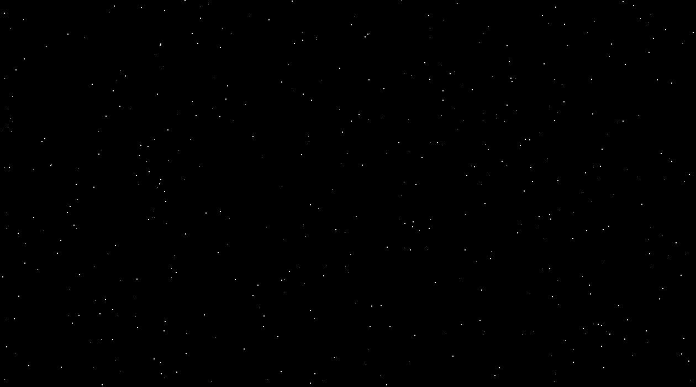

# Red Dwarf XII logo
> A reproduction of the Red Dwarf XII logo animation

## Table of contents
* [General info](#general-info)
* [Screenshots](#screenshots)
* [Technologies](#technologies)
* [Learnings](#learnings)
* [Setup](#setup)
* [Status](#status)
* [Inspiration](#inspiration)
* [Contact](#contact)

## General info
I wanted to practise animation in CSS. When watching Red Dwarf XII I watched the logo animate onto screen and decided that reproducing that was the perfect thing to practise with.

## Screenshots

## Technologies
* HTML
* SCSS
* JavaScript
* Gulp 4

## Learnings
* CSS animations
* HTML Canvas

## Setup
To view this project visit the [demo](https://reddwarfxii.netlify.app/) or download the files and open index.html

## Status
Project is: _finished_

## Inspiration
Red Dwarf XII

## Contact
Created by [nicm42](https://www.twitter.com/nicm4242) - feel free to contact me!
